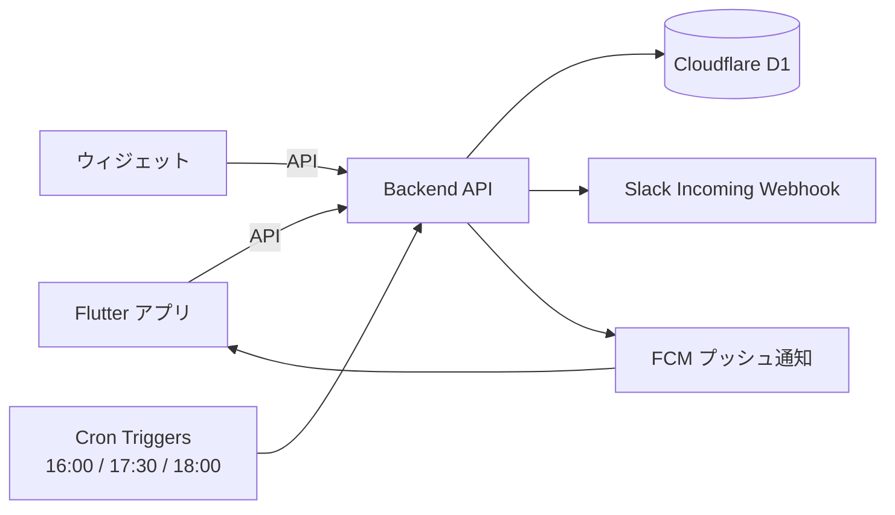

# メシイコ デザインドック

作成 2026-09-19 / 最終更新 2026-09-20

API の詳細な仕様は `back/api/openapi.yaml` が正（Single Source of Truth）。
このドックはその背景と決定理由を残す。両者が食い違った場合は openapi.yaml を優先する。

## 1. 概要

友達同士で毎日アンケートに答えるだけで、今日ご飯に行ける人と時間帯がわかるサービスを、2026/09/23までに作る。

| 項目 | 内容 |
| --- | --- |
| プロダクト名（仮） | メシイコ |
| 一言説明 | 友達同士で毎日ご飯に行くかどうかを簡単に確認できるサービス |
| 背景・きっかけ | 今はLINEで一人ずつ確認していて手間がかかる。連絡が遅く、相手がもう食べ終わっていることがある。車を出せる人以外は誘いづらく、外食の機会を逃している。 |
| 目的・ゴール | 行けるかどうかを簡単に記録・確認できるようにし、外食の機会損失を減らす。利用者は10人程度。 |
| 成功の指標 | 1週間の回答率80%以上（回答した日数 ÷ 配信日数 × 人数）。 |
| 期限 | 2026/09/23（シルバーウィーク） |

## 2. スコープ

期限まで4日しかないため、MVPの中でもさらに「9/23に絶対必要なもの」を決めておく（セクション9のリスク参照）。

**やること（MVP）**

- ユーザー登録・ログイン（一意のuserID（好きな名前）と自動生成のindex番号）
- 毎日「行ける」「行けない」を簡単に回答できるアンケート機能
- 行ける人は30分ごとの行ける時間帯を選択できる機能
- iOS / Android 両方対応
- ウィジェットでアンケート回答・結果確認
- 未回答のユーザーへのリマインド通知
- 16:00にアンケートを配信
- 18:00にアンケートを一時締め切り（締め切り後の変更は暫定で受け付けない。セクション9の未決事項参照）
- Slack連携でアンケート結果を通知

**次フェーズ以降でやること**

- macOS対応
- バックアップ・可用性の検討
- 行ける人同士でお店・集合場所を決める機能（例：候補の投票）
- 車を出せる人の表示（背景にある「誘いづらさ」への対策）

**やらないこと（Non-Goals）**

- 多言語対応
- App Store / Google Play への公開
- メールアドレスやパスワードによるユーザー登録

## 3. ユーザーとユースケース

想定ユーザー：普段一緒にご飯に行く友人グループ約10人、スマホ中心、連絡はLINE・Slack。

| # | ユーザーは… | …したい | なぜなら… |
| --- | --- | --- | --- |
| U1 | 仲の良い友人 | 毎日ご飯に行けるかをワンタップで答えたい | 一人ずつLINEで聞かれるのは手間だから |
| U2 | ご飯に誘いたい人 | 今日行ける人と時間帯を一覧で見たい | 誘う前に相手の都合がわかれば声をかけやすいから |
| U3 | 回答を忘れがちな人 | 締め切り前に通知で思い出したい | 気づいたら締め切りを過ぎているから |
| U4 | 普段Slackを見ている人 | 結果をSlackで確認したい | アプリを開かずに済むから |

## 4. 機能要件

今は全部 Must だが、期限を考えると F4・F5 は Should に下げる候補（セクション9参照）。

| ID | 機能 | 説明 | 優先度 | 対応ユースケース | 担当 |
| --- | --- | --- | --- | --- | --- |
| F1 | ユーザー登録・ログイン | 好きなuserIDだけで登録。登録時にセッショントークンを発行し、以後は自動ログイン | Must | U1 |  |
| F2 | アンケート回答 | 当日分に「行ける」「行けない」をワンタップで回答・変更できる | Must | U1 |  |
| F3 | 行ける時間帯の選択 | 行ける人は30分刻みの時間帯（例：17:00〜23:00）を複数選択できる | Must | U1 |  |
| F4 | ウィジェット対応 | ホーム画面のウィジェットから回答・結果確認ができる | Must | U1, U2 |  |
| F5 | リマインド通知 | 未回答のユーザーに締め切り前（例：17:30）に通知する | Must | U3 |  |
| F6 | アンケート配信・締め切り | 16:00に当日分を配信し、18:00に一時締め切り | Must | U1 |  |
| F7 | Slack連携 | 配信・締め切り時に結果（行ける人と時間帯）をSlackに投稿する | Must | U4 |  |
| F8 | 結果一覧 | 当日の行ける人と、時間帯ごとの人数を表示する | Must | U2 |  |

## 5. 非機能要件

| 観点 | 目標・方針 |
| --- | --- |
| 想定ユーザー数・負荷 | 同時に10人程度 |
| 対応環境 | iOS / Android |
| パフォーマンス | アプリの結果表示は1分ごとに更新。ウィジェットはOSの更新回数制限があるため、リアルタイムではなく「回答時・アプリ起動時に即更新＋定期更新」を目標にする |
| セキュリティ | 基本的な個人情報以外は扱わない。利用者向けAPIは `Authorization: Bearer <セッショントークン>` で認証する。Cronなどサーバ間から叩く管理用APIは、取り違えを防ぐため別ヘッダ `X-Admin-Token` で認証する。ただしログインはuserIDのみで通るため、なりすまし自体は防げない（セクション9のリスク参照） |
| 可用性・バックアップ | 本番運用後に次フェーズで検討 |
| 運用コスト | 完全無料。Apple Developer Program（有料）には登録しない |
| タイムゾーン | すべて日本時間（JST）で扱う |

## 6. 技術スタック

| レイヤー | 採用技術 | 選定理由 | 検討した他の候補 |
| --- | --- | --- | --- |
| フロントエンド | Flutter | 1つのコードでAndroidアプリとiPhone向けWeb版（PWA）を作れる。学習コストが低い | Tauri / React Native |
| ウィジェット | Kotlin（Glance）+ home\_widget パッケージ（Androidのみ。iPhoneはショートカットで代替） | Flutterだけではウィジェットを書けないため、各OSのネイティブコードが必要 |  |
| バックエンド / API | Go（Gin） | 高性能でスケーラブルなサーバー開発に適している | Node.js / Python |
| データベース | Cloudflare D1（SQLite） | 小規模アプリに適していて無料 | AWS RDS / Supabase / Firebase |
| 認証 | 自前（userID＋セッショントークン） | 簡単なIDで登録・ログインできる。利用者向けはBearerトークン、Cron等の管理用は `X-Admin-Token` に分離 | Firebase / Auth0 / Google Sign-In |
| インフラ・ホスティング | Cloudflare | 無料で利用可能 | AWS EC2 |
| 定時処理 | Cloudflare Cron Triggers | 16:00配信・17:30リマインド・18:00締め切りを実行 | GitHub Actions の schedule |
| 通知 | FCM（Firebase Cloud Messaging） | iOS / Android 両方に無料でプッシュ通知できる | Slack DMで代替 |
| CI/CD | GitHub Actions | GitHubと連携して自動化できる | Jenkins / Travis CI / Argo |
| 開発ツール | GitHub（Issues / Projects） | コード管理・タスク管理を一元化できる | GitLab / Bitbucket |

注意：Cloudflare Workers は Go（Gin）をそのまま動かせない（WebAssembly経由の限定的なサポートのみ）。「Go を別の無料ホストで動かしD1をREST APIで使う」か「Workers上を TypeScript（Hono）で書く」かを決める必要がある（未決事項）。Cron Triggers の時刻はUTC指定なので、16:00 JST は `0 7 * * *` になる。

## 7. アーキテクチャ・データ設計

CronがAPIを起動し、配信・リマインド・締め切りのたびにSlack投稿とプッシュ通知を行う。
Cronから叩くのは `PUT /polls/{date}`（配信・締め切り）と `POST /admin/notifications`（リマインド）の2つで、
どちらも `X-Admin-Token` で認証する。

**主要なデータ（エンティティ）**

元の案（User / date / today / count / statistics）は、集計値を別テーブルに持つと回答変更のたびに更新漏れが起きやすい。
集計値は持たず、人数は `answers` から都度集計する。プッシュ通知の宛先を保持する `devices` を加えた4テーブル構成とする。

| テーブル | 主な項目 | 関連 |
| --- | --- | --- |
| users | id（自動採番）, name（一意）, token, created\_at | answers を複数持つ |
| polls | date（主キー）, status（scheduled / open / closed）, opened\_at, closed\_at | その日の answers を持つ |
| answers | user\_id, date, status（undecided / available / unavailable）, time\_slots（例：\["18:00","18:30"\] のJSON）, updated\_at。主キーは (user\_id, date) | users と polls に属する |
| devices | user\_id, device\_token（一意）, os\_type（iOS / Android）, created\_at | users に属する |

`polls.status` が3つあるのは、16:00の配信と18:00の締め切りという2回の遷移を区別する必要があるため
（scheduled → open → closed）。2状態だと「受付中」と「締切」を区別できない。
遷移はこの一方向だけで、戻す向き（closed → open など）は拒否する。
行は `PUT /polls/{date}` が初回の遷移時に作る（upsert）ため事前のseedは不要で、
行がない日は `GET /polls/{date}` が scheduled として返す。

`answers.status` に undecided を含めるのは、「まだ答えていない」と「行けないと答えた」を
区別するため。F5のリマインドは前者だけに送る。

`devices.device_token` はFCMが端末ごとに発行するので全体で一意にする。
`POST /devices` は既存のトークンが送られたら紐づけ先を送信元のユーザーに付け替える（upsert）。
同じ端末で別アカウントにログインし直したときに、一意制約で失敗したり
前のユーザーに新しいユーザーの通知が届いたりするのを防ぐため。

**主要なAPI**

詳細は `back/api/openapi.yaml` を参照。日付はすべてJSTで、「今日」はサーバが決める。

| メソッド・パス | 認証 | 概要 | 対応機能 |
| --- | --- | --- | --- |
| GET /health | なし | プロセスとDB接続の死活確認 | — |
| POST /users | なし | userIDを登録し、セッショントークンを返す | F1 |
| POST /users/login | なし | 登録済みのuserIDでログインし、トークンを再発行 | F1 |
| POST /users/logout | Bearer | いま使っているトークンを無効化 | F1 |
| GET /users/me | Bearer | ログイン中のユーザー情報 | F1 |
| GET /users/{userId} | Bearer | 指定ユーザーの情報 | — |
| PUT /answers/me | Bearer | 当日の自分の回答を登録・更新（冪等） | F2, F3 |
| GET /answers | Bearer | 指定日（省略時は今日）の全員の回答 | F8 |
| GET /polls/{date} | Bearer | その日が配信前 / 受付中 / 締切のどれか | F6 |
| PUT /polls/{date} | Admin | 配信・締め切りの切り替え（Cronから） | F6 |
| POST /devices | Bearer | FCMの通知トークンを登録 | F5 |
| POST /admin/notifications | Admin | プッシュ通知の送信（全員 / 未回答者） | F5 |

設計上の判断：

- **回答はPUTで冪等にする。** 回答は (user\_id, date) に対して1件で、変更もできる必要がある（F2）。
  POSTで作成するとウィジェットやショートカットからの二重送信の扱いが曖昧になる。
- **対象日と回答者はリクエストで受け取らない。** 日付は端末の時計やタイムゾーンに依存させず
  サーバがJSTで決め、回答者はトークンから特定する。
- **集計専用のAPIは作らない。** 10人規模なので `GET /answers` の全件から
  クライアントが時間帯ごとの人数を出す。集計APIを別に持つと回答変更時の整合を保つ手間が増える。
- **回答に userName を含める。** 結果画面を描くたびに人数分の `GET /users/{userId}` を
  叩かずに済ませるため。

**主要な画面**

| 画面 | 概要 |
| --- | --- |
| 登録画面 | userIDを入力するだけ |
| 今日の回答画面 | 行ける/行けないボタンと時間帯の選択 |
| 結果画面 | 行ける人と時間帯ごとの人数 |
| ウィジェット（小） | 回答ボタンと行ける人数 |

## 8. 開発体制・スケジュール

**役割分担**（4人。担当領域ごとに並行して進められる分け方の例。名前と時間を記入）

| メンバー | 担当領域 | 主な機能 | 9/19〜9/23 に使える時間 |
| --- | --- | --- | --- |
|  | バックエンドAPI・DB設計 | F1, F2, F3, F8 のAPI |  |
|  | 定時処理・外部連携（Cron、Slack、プッシュ通知送信） | F5, F6, F7 |  |
|  | Flutterアプリ（登録・回答・結果画面） | F1, F2, F3, F8 の画面 |  |
|  | ウィジェット（Swift / Kotlin）・実機への配布 | F4、iPhone配布方法の調査 |  |

**開発ルール**

- ブランチ運用：main＋機能ごとのブランチ。PRは相手が軽く見てからマージ（急ぎのときは事後レビュー可）
- 定例：期限までは毎晩15分、その日の進捗と翌日の作業を確認
- 連絡手段：Slack（結果通知と同じワークスペース）
- タスク管理：GitHub Issues に機能ID（F1〜F8）をつけて起票

**マイルストーン**

| 日付 | マイルストーン | 完了条件 |
| --- | --- | --- |
| 9/19（土） | 設計確定 | 未決事項がゼロ、技術スタック確定 |
| 9/20（日） | 環境構築・API | 全員がローカルで動かせる。F1・F2・F3のAPIが動く |
| 9/21（月） | アプリ本体 | 登録・回答・結果画面が実機で動く（F8まで） |
| 9/22（火） | 定時処理・連携 | 配信・締め切り・Slack投稿が動く（F6・F7）。余裕があればF4・F5 |
| 9/23（水） | 公開・テスト | 友人の端末にインストールして使ってもらう |

## 9. リスク・未決事項・決定ログ

**リスクと対策**

Apple Developer Program に登録しないため、iPhoneにはネイティブアプリを配らず、Web版（PWA）＋Slack通知＋ショートカットで同じ体験に近づける。Androidはこれまでどおりネイティブアプリ。

**iPhoneへの配布方法の比較（有料登録なし）**

| 方法 | 費用 | 通知 | ウィジェット相当 | 判断 |
| --- | --- | --- | --- | --- |
| PWA（Flutter Web を Cloudflare Pages でホストし、ホーム画面に追加） | 無料 | Webプッシュ（iOS 16.4以降、ホーム画面に追加した場合のみ） | ショートカットで代替 | 採用。URLを送るだけで配れ、更新も自動 |
| Slack で回答・通知（ボタン付きメッセージ） | 無料 | Slackの通知 | Slackの通知から直接回答 | 採用（リマインドと回答の補助） |
| 無料のApple IDでXcodeから直接インストール | 無料 | プッシュ通知は不可 | 一部制限あり | 不採用。7日ごとに再インストールが必要で、友人ごとにMacへ接続する手間がある |
| TestFlight / AdHoc / 非表示アプリ など | 有料登録が必要 | — | — | 不採用 |
| 日本の代替アプリマーケット・Web配信（2025年12月〜、iOS 26.2以降） | 配信者は有料登録と Apple の公証が必要 | — | — | 不採用 |

**iPhoneでの使い方**

1. 招待URLを Safari で開き、「ホーム画面に追加」する（アイコンから全画面で起動できる）
2. 初回だけ userID を登録し、通知を許可する
3. 回答は「アプリ」か「Slackのボタン」のどちらからでもできる
4. ウィジェットの代わりに、ショートカットアプリで「行ける」「行けない」をAPIに送るショートカットを配布し、ホーム画面のショートカットウィジェットに置く（Should）

Androidは APK を GitHub Releases などで配れば、無料でネイティブアプリ（通知・ウィジェット込み）が使える。

**リスクと対策**

| リスク | 影響 | 対策 |
| --- | --- | --- |
| iPhoneのWebプッシュはホーム画面に追加しないと届かず、届かない人も出やすい | リマインドを見逃す | リマインドと結果はSlackでも送る（F5・F7をSlackで兼ねる） |
| iPhoneではネイティブのウィジェットが作れない | F4がiPhoneで実現できない | F4はAndroidのみ。iPhoneはショートカットウィジェットで代替 |
| Flutter Web は初回表示が重め | 開くのが面倒で回答率が下がる | 回答画面を最初に表示し、画面数を最小にする |
| Cloudflare Workers で Go（Gin）が動かない | バックエンドの作り直し | 無料で完結させるならWorkers上をTypeScript（Hono）で書くのが最も確実。Goを使う場合は無料で常時動かせるホストを9/19中に探す |
| 無料枠の上限を超える | サービスが止まる | 10人規模なら Cloudflare・FCM・Slack の無料枠で十分。念のため各サービスで課金設定をしない |
| 期限まで4日で Must が8個ある | MVPが完成しない | 削る順番を決めておく：F4 → F5 → F7 の順に後回し |
| userIDだけのログインでなりすましできる | 他人の回答を書き換えられる | 受け入れる。`POST /users/login` はuserIDだけでトークンを発行するため、名前を知っていれば他人になりすませる。友人10人の範囲なのでこれ以上はやらない。ログインのたびにトークンを再発行し以前のものを無効化するので、乗っ取られた側は端末から弾き出されて異変に気づける |
| 管理用APIが誰でも叩ける | 全員に無関係な通知が飛ぶ、締め切り状態を勝手に操作される | `PUT /polls/{date}` と `POST /admin/notifications` は `X-Admin-Token` で認証する。値は環境変数で渡し、リポジトリには置かない |

参考：[iOS アプリの配布方法（Zenn）](https://zenn.dev/yusuga/articles/9e9b632e0338b2)、[日本におけるiOSの変更（Apple Developer）](https://developer.apple.com/jp/support/app-distribution-in-japan/)

**未決事項**

- [ ] バックエンドの実行環境：Workers上をTypeScript（Hono）で書く / Goを無料の別ホストで動かす
- [ ] Slackでの回答（ボタン付きメッセージ）をMVPに入れるか、通知だけにするか
- [ ] 18:00の一時締め切り後に回答・変更を受け付けるか、「一時」締め切りの後に本締め切りがあるか
  - 暫定：受け付けない。`PUT /answers/me` が締切後は 409 を返す。受け付ける方針にするなら409を消すだけでよい
- [ ] 選択できる時間帯の範囲（例：17:00〜23:00）
  - 暫定：APIは00:00〜23:30の30分刻みをすべて受け付ける。範囲を絞るならクライアント側の選択肢で制限するか、サーバ側のバリデーションを足す
- [ ] Slackに投稿するタイミングと内容（16:00配信時、18:00締め切り時、回答があるたび など）
  - APIは未着手。Slack投稿は `PUT /polls/{date}` の副作用にするか、専用エンドポイントを足すかも未決
- [x] データ設計はセクション7の案でよいか → devices を加えた4テーブルで確定（2026-09-20）

**決定ログ**

| 日付 | 決定内容 | 理由 | 決めた人 |
| --- | --- | --- | --- |
| 2026-09-19 | フロントエンドはFlutter | iOS / Android 両対応で学習コストが低い |  |
| 2026-09-19 | DBはCloudflare D1 | 小規模で無料 |  |
| 2026-09-19 | 認証はメール・パスワードを使わず自前のuserIDのみ | 友人内で手軽に使うため |  |
| 2026-09-19 | ストア公開・多言語対応はしない | 利用者が友人10人程度のため |  |
| 2026-09-19 | 開発・運用は無料を基本とする | 友人内の小規模サービスのため |  |
| 2026-09-19 | Apple Developer Programには登録しない。iPhoneはPWA＋Slack＋ショートカットで対応 | 完全無料で運用するため |  |
| 2026-09-20 | API仕様は `back/api/openapi.yaml` を正とし、Goのコードは oapi-codegen で生成する | 仕様と実装のズレをコンパイラに検出させるため |  |
| 2026-09-20 | 回答は `PUT /answers/me` とし、対象日と回答者はリクエストで受け取らない | 冪等にして二重送信を安全にし、端末の時計・タイムゾーンに依存させないため |  |
| 2026-09-20 | 集計専用APIは作らず、`GET /answers` の全件からクライアントが集計する | 10人規模では集計APIを別に持つ方が整合を保つ手間が大きいため |  |
| 2026-09-20 | `polls.status` は scheduled / open / closed の3状態にする | 16:00の配信と18:00の締め切りという2回の遷移を区別する必要があるため |  |
| 2026-09-20 | プッシュ通知の宛先を保持する devices テーブルを追加する | FCMトークンはユーザーごとに複数・失効しうるので users に持たせられないため |  |
| 2026-09-20 | Cron等の管理用APIはユーザーとは別の `X-Admin-Token` で認証する | 誰でも全員に通知を送れる状態を塞ぎ、トークンの取り違えも防ぐため |  |
| 2026-09-20 | userIDだけでログインできる状態を受け入れる | 友人10人の範囲であり、合言葉を足すコストに見合わないため |  |
| 2026-09-20 | pollの行は `PUT /polls/{date}` のupsertで作り、行がない日は scheduled として返す | 事前seedや作成用エンドポイントを増やさずに3状態を表せるため |  |
| 2026-09-20 | `devices.device_token` は既存なら紐づけ先を付け替える（upsert） | 同じ端末で別アカウントにログインしたときの一意制約違反と誤配信を防ぐため |  |
