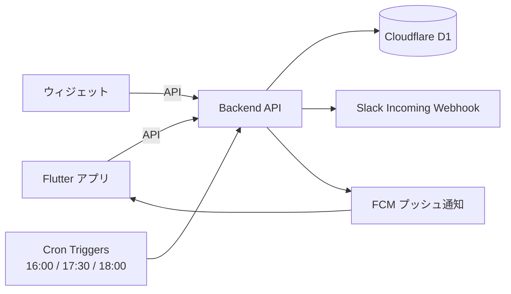

# メシイコ デザインドック

2026-09-19 

## 1. 概要

友達同士で毎日アンケートに答えるだけで、今日ご飯に行ける人と時間帯がわかるサービスを、2026/09/23までに作る。

| 項目 | 内容 |
| --- | --- |
| プロダクト名（仮） | メシイコ |
| 一言説明 | 友達同士で毎日ご飯に行くかどうかを簡単に確認できるサービス |
| 背景・きっかけ | 今はLINEで一人ずつ確認していて手間がかかる。連絡が遅く、相手がもう食べ終わっていることがある。車を出せる人以外は誘いづらく、外食の機会を逃している。 |
| 目的・ゴール | 行けるかどうかを簡単に記録・確認できるようにし、外食の機会損失を減らす。利用者は10人程度。 |
| 成功の指標 | 1週間の回答率80%以上（回答した日数 ÷ 配信日数 × 人数）。 |
| 期限 | 2026/09/23（シルバーウィーク） |

## 2. スコープ

期限まで4日しかないため、MVPの中でもさらに「9/23に絶対必要なもの」を決めておく（セクション9のリスク参照）。

**やること（MVP）**

- ユーザー登録・ログイン（一意のuserID（好きな名前）と自動生成のindex番号）
- 毎日「行ける」「行けない」を簡単に回答できるアンケート機能
- 行ける人は30分ごとの行ける時間帯を選択できる機能
- iOS / Android 両方対応
- ウィジェットでアンケート回答・結果確認
- 未回答のユーザーへのリマインド通知
- 16:00にアンケートを配信
- 18:00にアンケートを一時締め切り（締め切り後も回答の変更は可能にするかは未決）
- Slack連携でアンケート結果を通知

**次フェーズ以降でやること**

- macOS対応
- バックアップ・可用性の検討
- 行ける人同士でお店・集合場所を決める機能（例：候補の投票）
- 車を出せる人の表示（背景にある「誘いづらさ」への対策）

**やらないこと（Non-Goals）**

- 多言語対応
- App Store / Google Play への公開
- メールアドレスやパスワードによるユーザー登録

## 3. ユーザーとユースケース

想定ユーザー：普段一緒にご飯に行く友人グループ約10人、スマホ中心、連絡はLINE・Slack。

| # | ユーザーは… | …したい | なぜなら… |
| --- | --- | --- | --- |
| U1 | 仲の良い友人 | 毎日ご飯に行けるかをワンタップで答えたい | 一人ずつLINEで聞かれるのは手間だから |
| U2 | ご飯に誘いたい人 | 今日行ける人と時間帯を一覧で見たい | 誘う前に相手の都合がわかれば声をかけやすいから |
| U3 | 回答を忘れがちな人 | 締め切り前に通知で思い出したい | 気づいたら締め切りを過ぎているから |
| U4 | 普段Slackを見ている人 | 結果をSlackで確認したい | アプリを開かずに済むから |

## 4. 機能要件

今は全部 Must だが、期限を考えると F4・F5 は Should に下げる候補（セクション9参照）。

| ID | 機能 | 説明 | 優先度 | 対応ユースケース | 担当 |
| --- | --- | --- | --- | --- | --- |
| F1 | ユーザー登録・ログイン | 好きなuserIDだけで登録。登録時に端末用トークンを発行し、以後は自動ログイン | Must | U1 |  |
| F2 | アンケート回答 | 当日分に「行ける」「行けない」をワンタップで回答・変更できる | Must | U1 |  |
| F3 | 行ける時間帯の選択 | 行ける人は30分刻みの時間帯（例：17:00〜23:00）を複数選択できる | Must | U1 |  |
| F4 | ウィジェット対応 | ホーム画面のウィジェットから回答・結果確認ができる | Must | U1, U2 |  |
| F5 | リマインド通知 | 未回答のユーザーに締め切り前（例：17:30）に通知する | Must | U3 |  |
| F6 | アンケート配信・締め切り | 16:00に当日分を配信し、18:00に一時締め切り | Must | U1 |  |
| F7 | Slack連携 | 配信・締め切り時に結果（行ける人と時間帯）をSlackに投稿する | Must | U4 |  |
| F8 | 結果一覧 | 当日の行ける人と、時間帯ごとの人数を表示する | Must | U2 |  |

## 5. 非機能要件

| 観点 | 目標・方針 |
| --- | --- |
| 想定ユーザー数・負荷 | 同時に10人程度 |
| 対応環境 | iOS / Android |
| パフォーマンス | アプリの結果表示は1分ごとに更新。ウィジェットはOSの更新回数制限があるため、リアルタイムではなく「回答時・アプリ起動時に即更新＋定期更新」を目標にする |
| セキュリティ | 基本的な個人情報以外は扱わない。なりすまし防止のためAPIは端末トークンで認証 |
| 可用性・バックアップ | 本番運用後に次フェーズで検討 |
| 運用コスト | 完全無料。Apple Developer Program（有料）には登録しない |
| タイムゾーン | すべて日本時間（JST）で扱う |

## 6. 技術スタック

| レイヤー | 採用技術 | 選定理由 | 検討した他の候補 |
| --- | --- | --- | --- |
| フロントエンド | Flutter | 1つのコードでAndroidアプリとiPhone向けWeb版（PWA）を作れる。学習コストが低い | Tauri / React Native |
| ウィジェット | Kotlin（Glance）+ home\_widget パッケージ（Androidのみ。iPhoneはショートカットで代替） | Flutterだけではウィジェットを書けないため、各OSのネイティブコードが必要 |  |
| バックエンド / API | Go（Gin） | 高性能でスケーラブルなサーバー開発に適している | Node.js / Python |
| データベース | Cloudflare D1（SQLite） | 小規模アプリに適していて無料 | AWS RDS / Supabase / Firebase |
| 認証 | 自前（userID＋端末トークン） | 簡単なIDで登録・ログインできる | Firebase / Auth0 / Google Sign-In |
| インフラ・ホスティング | Cloudflare | 無料で利用可能 | AWS EC2 |
| 定時処理 | Cloudflare Cron Triggers | 16:00配信・17:30リマインド・18:00締め切りを実行 | GitHub Actions の schedule |
| 通知 | FCM（Firebase Cloud Messaging） | iOS / Android 両方に無料でプッシュ通知できる | Slack DMで代替 |
| CI/CD | GitHub Actions | GitHubと連携して自動化できる | Jenkins / Travis CI / Argo |
| 開発ツール | GitHub（Issues / Projects） | コード管理・タスク管理を一元化できる | GitLab / Bitbucket |

注意：Cloudflare Workers は Go（Gin）をそのまま動かせない（WebAssembly経由の限定的なサポートのみ）。「Go を別の無料ホストで動かしD1をREST APIで使う」か「Workers上を TypeScript（Hono）で書く」かを決める必要がある（未決事項）。Cron Triggers の時刻はUTC指定なので、16:00 JST は `0 7 * * *` になる。

## 7. アーキテクチャ・データ設計

CronがAPIを起動し、配信・リマインド・締め切りのたびにSlack投稿とプッシュ通知を行う。

**主要なデータ（エンティティ）**

元の案（User / date / today / count / statistics）は、集計値を別テーブルに持つと回答変更のたびに更新漏れが起きやすい。下の3テーブルにまとめ、人数は `answers` から都度集計する案を提案します。

| テーブル | 主な項目 | 関連 |
| --- | --- | --- |
| users | id（自動採番）, name（一意）, token, created\_at | answers を複数持つ |
| polls | date（主キー）, status（open / closed）, opened\_at, closed\_at | その日の answers を持つ |
| answers | user\_id, date, status（行ける / 行けない）, time\_slots（例：\["18:00","18:30"\] のJSON）, updated\_at。主キーは (user\_id, date) | users と polls に属する |

**主要なAPI / 画面**

| 種類 | パス・画面名 | 概要 |
| --- | --- | --- |
| API | POST /users | userIDを登録し、端末トークンを返す |
| API | GET /polls/today | 当日のアンケート状態と自分の回答を取得 |
| API | PUT /polls/today/answer | 当日の回答（行ける/行けない、時間帯）を登録・更新 |
| API | GET /polls/today/summary | 行ける人の一覧と時間帯ごとの人数 |
| API | POST /devices | FCMの通知トークンを登録 |
| 内部処理 | Cron：配信 / リマインド / 締め切り | polls の作成・更新、通知、Slack投稿 |
| 画面 | 登録画面 | userIDを入力するだけ |
| 画面 | 今日の回答画面 | 行ける/行けないボタンと時間帯の選択 |
| 画面 | 結果画面 | 行ける人と時間帯ごとの人数 |
| 画面 | ウィジェット（小） | 回答ボタンと行ける人数 |

## 8. 開発体制・スケジュール

**役割分担**（4人。担当領域ごとに並行して進められる分け方の例。名前と時間を記入）

| メンバー | 担当領域 | 主な機能 | 9/19〜9/23 に使える時間 |
| --- | --- | --- | --- |
|  | バックエンドAPI・DB設計 | F1, F2, F3, F8 のAPI |  |
|  | 定時処理・外部連携（Cron、Slack、プッシュ通知送信） | F5, F6, F7 |  |
|  | Flutterアプリ（登録・回答・結果画面） | F1, F2, F3, F8 の画面 |  |
|  | ウィジェット（Swift / Kotlin）・実機への配布 | F4、iPhone配布方法の調査 |  |

**開発ルール**

- ブランチ運用：main＋機能ごとのブランチ。PRは相手が軽く見てからマージ（急ぎのときは事後レビュー可）
- 定例：期限までは毎晩15分、その日の進捗と翌日の作業を確認
- 連絡手段：Slack（結果通知と同じワークスペース）
- タスク管理：GitHub Issues に機能ID（F1〜F8）をつけて起票

**マイルストーン**

| 日付 | マイルストーン | 完了条件 |
| --- | --- | --- |
| 9/19（土） | 設計確定 | 未決事項がゼロ、技術スタック確定 |
| 9/20（日） | 環境構築・API | 全員がローカルで動かせる。F1・F2・F3のAPIが動く |
| 9/21（月） | アプリ本体 | 登録・回答・結果画面が実機で動く（F8まで） |
| 9/22（火） | 定時処理・連携 | 配信・締め切り・Slack投稿が動く（F6・F7）。余裕があればF4・F5 |
| 9/23（水） | 公開・テスト | 友人の端末にインストールして使ってもらう |

## 9. リスク・未決事項・決定ログ

**リスクと対策**

Apple Developer Program に登録しないため、iPhoneにはネイティブアプリを配らず、Web版（PWA）＋Slack通知＋ショートカットで同じ体験に近づける。Androidはこれまでどおりネイティブアプリ。

**iPhoneへの配布方法の比較（有料登録なし）**

| 方法 | 費用 | 通知 | ウィジェット相当 | 判断 |
| --- | --- | --- | --- | --- |
| PWA（Flutter Web を Cloudflare Pages でホストし、ホーム画面に追加） | 無料 | Webプッシュ（iOS 16.4以降、ホーム画面に追加した場合のみ） | ショートカットで代替 | 採用。URLを送るだけで配れ、更新も自動 |
| Slack で回答・通知（ボタン付きメッセージ） | 無料 | Slackの通知 | Slackの通知から直接回答 | 採用（リマインドと回答の補助） |
| 無料のApple IDでXcodeから直接インストール | 無料 | プッシュ通知は不可 | 一部制限あり | 不採用。7日ごとに再インストールが必要で、友人ごとにMacへ接続する手間がある |
| TestFlight / AdHoc / 非表示アプリ など | 有料登録が必要 | — | — | 不採用 |
| 日本の代替アプリマーケット・Web配信（2025年12月〜、iOS 26.2以降） | 配信者は有料登録と Apple の公証が必要 | — | — | 不採用 |

**iPhoneでの使い方**

1. 招待URLを Safari で開き、「ホーム画面に追加」する（アイコンから全画面で起動できる）
2. 初回だけ userID を登録し、通知を許可する
3. 回答は「アプリ」か「Slackのボタン」のどちらからでもできる
4. ウィジェットの代わりに、ショートカットアプリで「行ける」「行けない」をAPIに送るショートカットを配布し、ホーム画面のショートカットウィジェットに置く（Should）

Androidは APK を GitHub Releases などで配れば、無料でネイティブアプリ（通知・ウィジェット込み）が使える。

**リスクと対策**

| リスク | 影響 | 対策 |
| --- | --- | --- |
| iPhoneのWebプッシュはホーム画面に追加しないと届かず、届かない人も出やすい | リマインドを見逃す | リマインドと結果はSlackでも送る（F5・F7をSlackで兼ねる） |
| iPhoneではネイティブのウィジェットが作れない | F4がiPhoneで実現できない | F4はAndroidのみ。iPhoneはショートカットウィジェットで代替 |
| Flutter Web は初回表示が重め | 開くのが面倒で回答率が下がる | 回答画面を最初に表示し、画面数を最小にする |
| Cloudflare Workers で Go（Gin）が動かない | バックエンドの作り直し | 無料で完結させるならWorkers上をTypeScript（Hono）で書くのが最も確実。Goを使う場合は無料で常時動かせるホストを9/19中に探す |
| 無料枠の上限を超える | サービスが止まる | 10人規模なら Cloudflare・FCM・Slack の無料枠で十分。念のため各サービスで課金設定をしない |
| 期限まで4日で Must が8個ある | MVPが完成しない | 削る順番を決めておく：F4 → F5 → F7 の順に後回し |
| userIDだけのログインでなりすましできる | 他人の回答を書き換えられる | 端末トークンで認証。友人内なのでそれ以上はやらない |

参考：[iOS アプリの配布方法（Zenn）](https://zenn.dev/yusuga/articles/9e9b632e0338b2)、[日本におけるiOSの変更（Apple Developer）](https://developer.apple.com/jp/support/app-distribution-in-japan/)

**未決事項**

- [ ] バックエンドの実行環境：Workers上をTypeScript（Hono）で書く / Goを無料の別ホストで動かす
- [ ] Slackでの回答（ボタン付きメッセージ）をMVPに入れるか、通知だけにするか
- [ ] 18:00の一時締め切り後に回答・変更を受け付けるか、「一時」締め切りの後に本締め切りがあるか
- [ ] 選択できる時間帯の範囲（例：17:00〜23:00）
- [ ] Slackに投稿するタイミングと内容（16:00配信時、18:00締め切り時、回答があるたび など）
- [ ] 土日・祝日も配信するか
- [ ] データ設計はセクション7の3テーブル案でよいか

**決定ログ**

| 日付 | 決定内容 | 理由 | 決めた人 |
| --- | --- | --- | --- |
| 2026-09-19 | フロントエンドはFlutter | iOS / Android 両対応で学習コストが低い |  |
| 2026-09-19 | DBはCloudflare D1 | 小規模で無料 |  |
| 2026-09-19 | 認証はメール・パスワードを使わず自前のuserIDのみ | 友人内で手軽に使うため |  |
| 2026-09-19 | ストア公開・多言語対応はしない | 利用者が友人10人程度のため |  |
| 2026-09-19 | 開発・運用は無料を基本とする | 友人内の小規模サービスのため |  |
| 2026-09-19 | Apple Developer Programには登録しない。iPhoneはPWA＋Slack＋ショートカットで対応 | 完全無料で運用するため |  |
