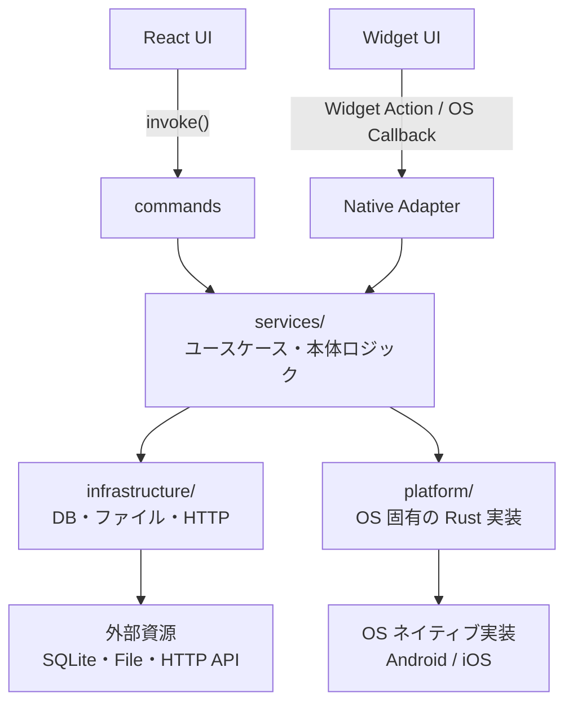

# Tauri + React + Typescript

This template should help get you started developing with Tauri, React and Typescript in Vite.

## Recommended IDE Setup

- [VS Code](https://code.visualstudio.com/) + [Tauri](https://marketplace.visualstudio.com/items?itemName=tauri-apps.tauri-vscode) + [rust-analyzer](https://marketplace.visualstudio.com/items?itemName=rust-lang.rust-analyzer)

## ファイル構成

```txt
front/
├─ src/                         # フロントエンド（React/Vue/Svelte 等）
│  ├─ components/
│  ├─ App.tsx
│  └─ main.tsx
│
├─ src-tauri/                   # ネイティブ側：Rust / Tauri
│  ├─ src/
│  │  ├─ platform/              # OS依存のRust実装
│  │  ├─ commands/              # Frontからの受付層
│  │  ├─ services/              # 本体の業務ロジック
│  │  ├─ infrastructure/        # 外部システムとの接続実装
│  │  ├─ main.rs                # 実行バイナリのエントリポイント
│  │  └─ lib.rs                 # Tauri Builder、command 登録
│  │
│  ├─ native/                   # OS依存のRust実装以外の資産(外部ライブラリやら)
│  ├─ capabilities/             # 権限設定
│  │  └─ default.json
│  ├─ icons/                    # アプリアイコン
│  ├─ Cargo.toml                # Rust crate と依存関係
│  ├─ build.rs                  # ビルド時処理
│  └─ tauri.conf.json           # アプリ名、ウィンドウ、bundle 設定など
│
├─ package.json                 # フロントエンドの依存関係・npm scripts
├─ vite.config.ts               # Vite 設定
└─ tsconfig.json
```

## システムアーキテクチャ

